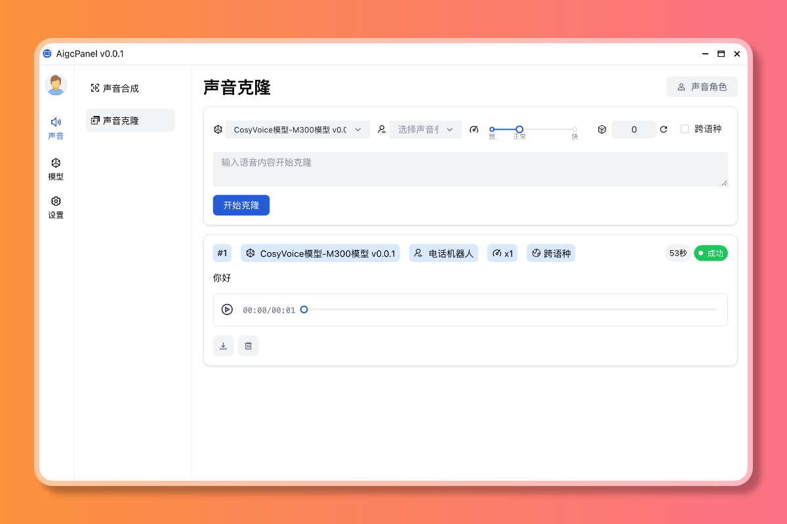
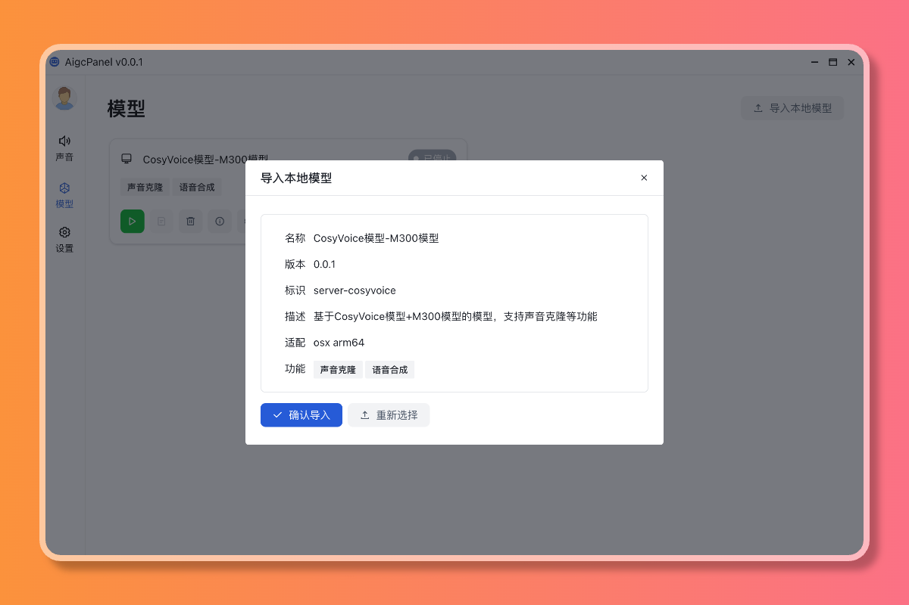
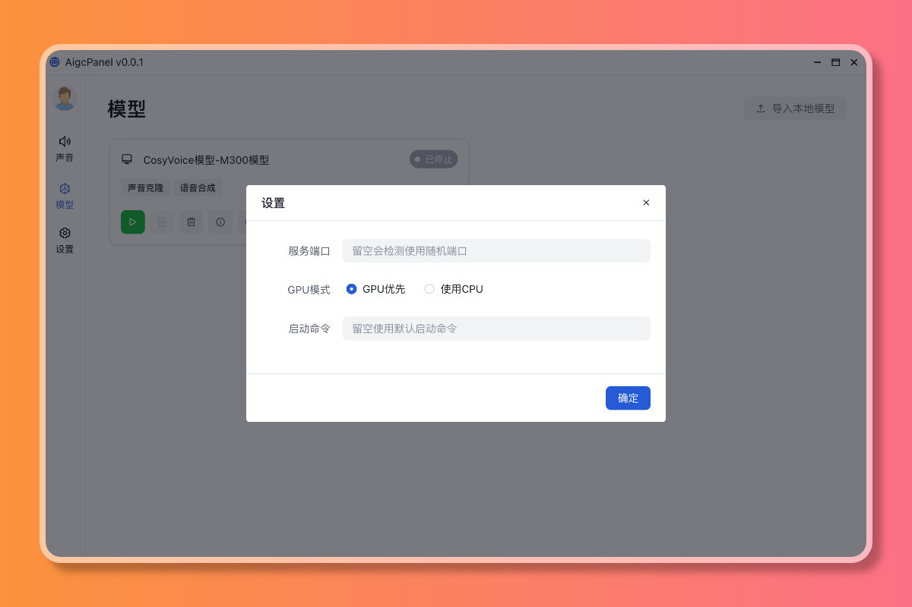
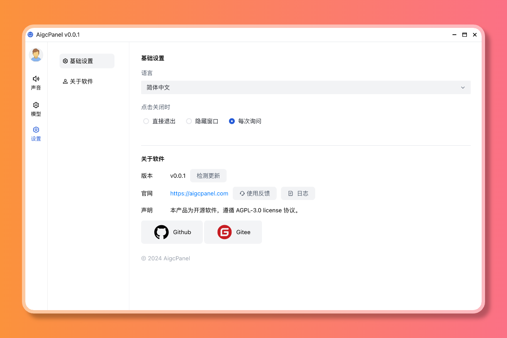

# AigcPanel



## 软件介绍

`AigcPanel` 是一个模型调用管理面板，简化本地模型管理、支持语音合成、语音克隆，一键导入和使用AI模型。

## 功能特性

- 支持语音合成、语音克隆
- 支持 cosyvoice 语音模型
- 支持多模型导入、模型设置、模型启动停止、模型日志查看
- 支持国际化，支持简体中文、英语

## 功能预览

### 语音克隆


### 语音合成


### 模型导入



### 模型设置



### 模型日志


### 关于



## 安装使用

### Windows

- 访问 [https://aigcpanel.com](https://aigcpanel.com) 下载 Windows 安装包，一键安装即可

### MacOS

- 访问 [https://aigcpanel.com](https://aigcpanel.com) 下载 MacOS 安装包，一键安装完成；

### Linux

- 访问 [https://aigcpanel.com](https://aigcpanel.com) 下载 Linux 安装包，一键安装完成；


## 技术栈

- `electron`
- `vue3`
- `typescript`

## 本地运行开发

> 仅在 node 20 测试过

```shell
# 安装依赖
npm install
# 调试运行
npm run dev
# 打包
npm run build
```

## 本程序中使用到了以下开源项目，特此感谢

- [CosyVoice](https://github.com/FunAudioLLM/CosyVoice)

## License

AGPL-3.0
