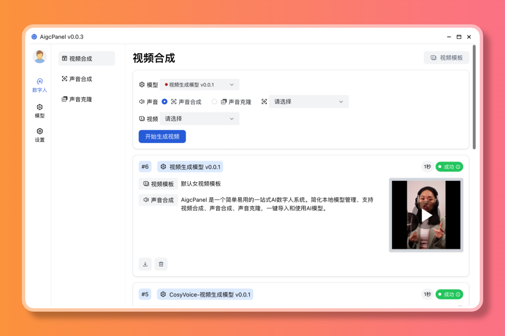
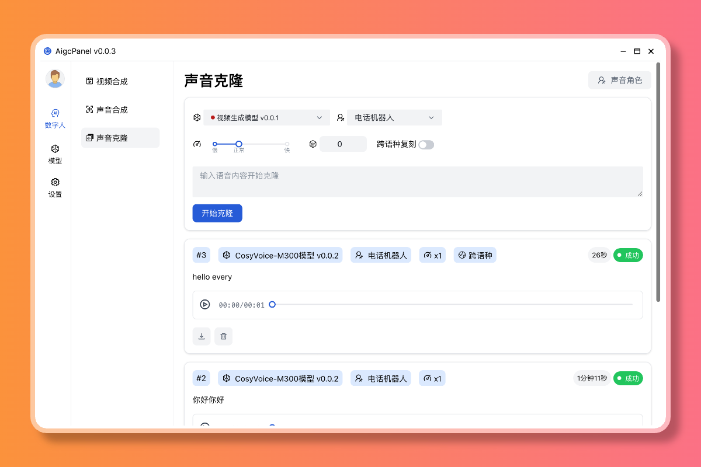
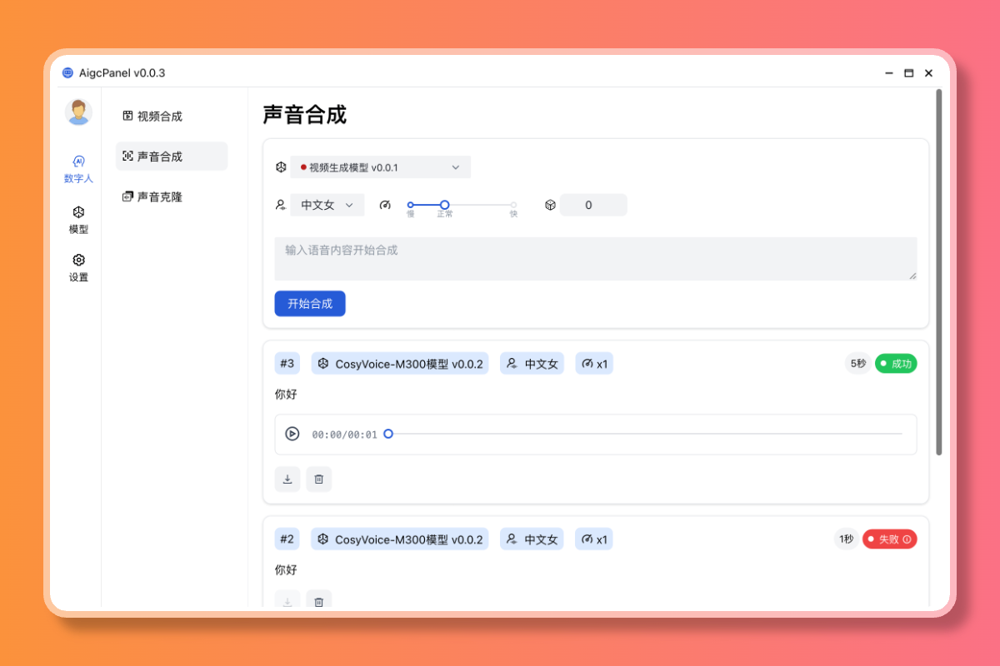
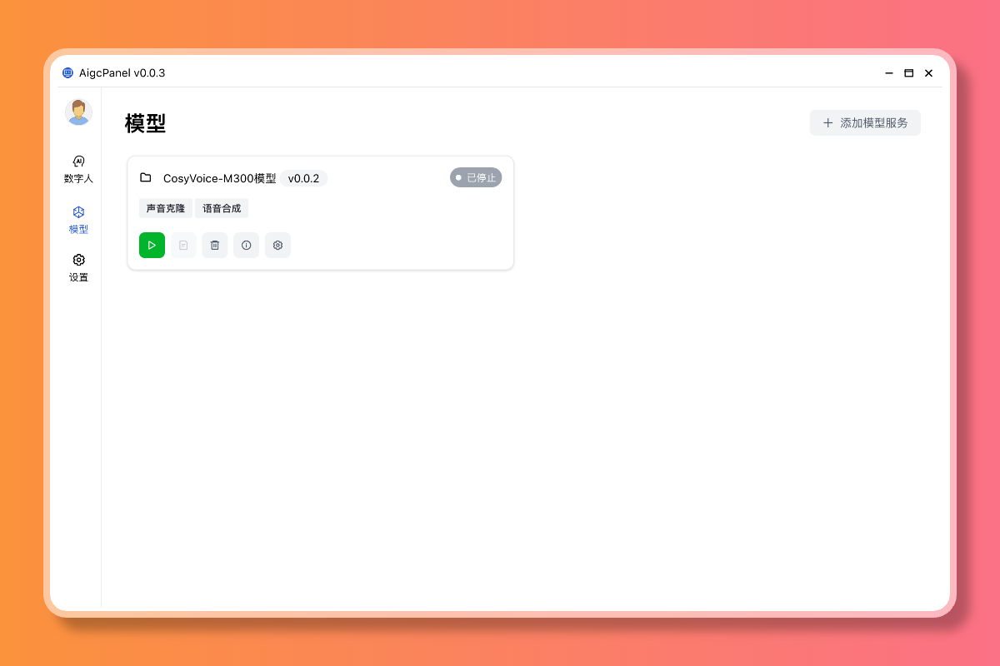
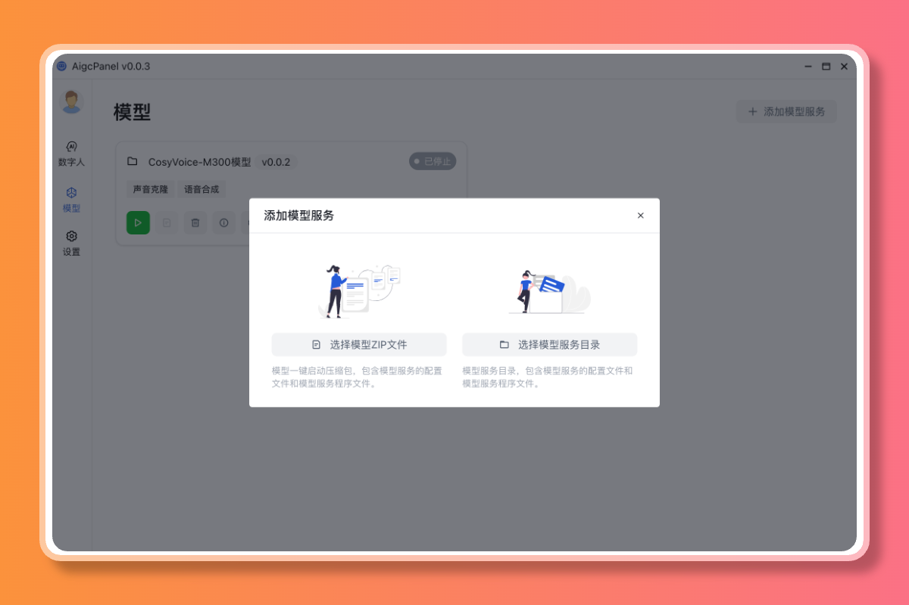
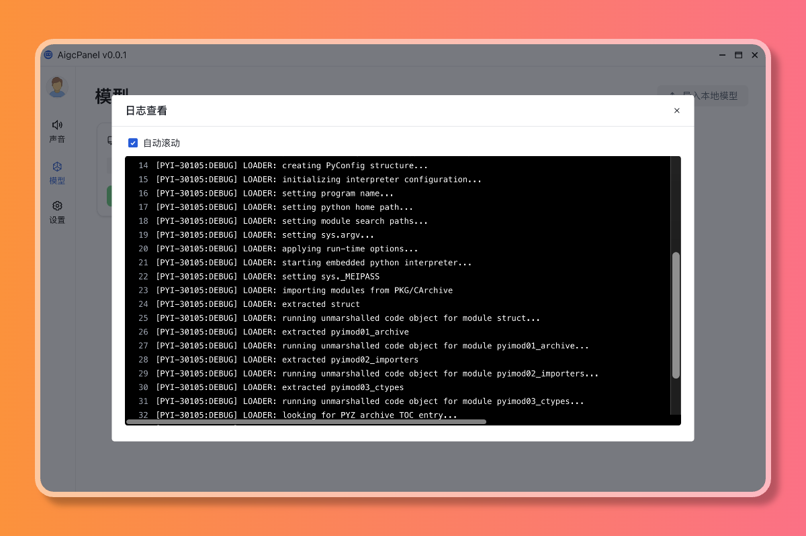
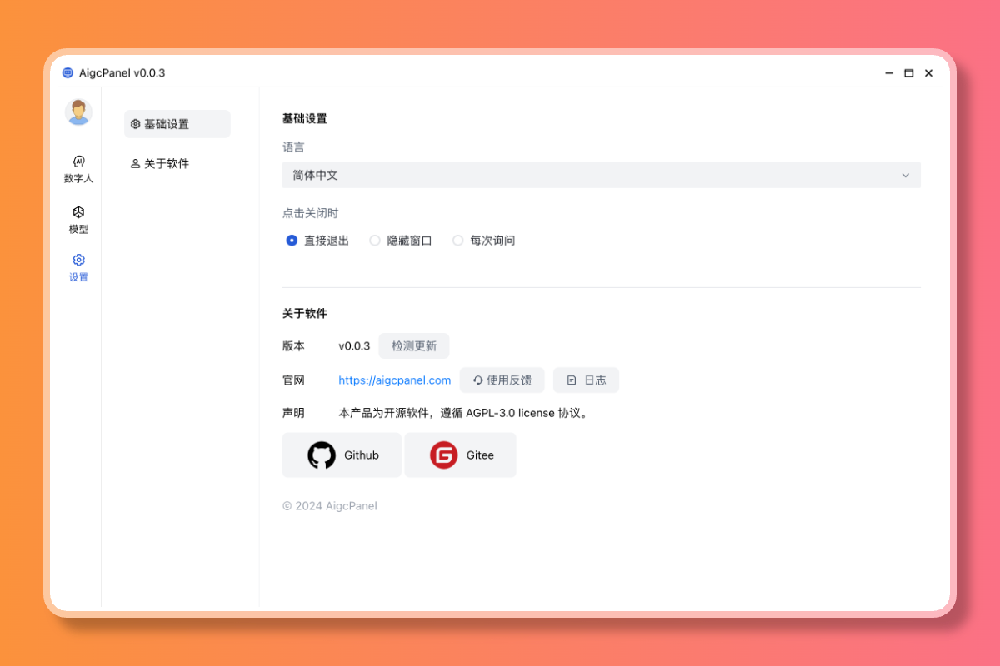

# AigcPanel


## 软件介绍

`AigcPanel` 是一个简单易用的一站式AI数字人系统，小白也可使用。
支持视频合成、声音合成、声音克隆，简化本地模型管理、一键导入和使用AI模型。

> 禁止使用本产品进行违法违规业务，使用本软件请遵守中华人民共和国法律法规。

## 功能特性

- 支持视频数字人合成，支持视频画面和声音换口型匹配
- 支持语音合成、语音克隆，多种声音参数可设置
- 支持多模型导入、一键启动、模型设置、模型日志查看
- 支持国际化，支持简体中文、英语
- 支持多种模型一键启动包：`MuseTalk`、`cosyvoice`

## 效果预览

<table class="center">
  <tr style="font-weight: bolder;text-align:center;">
    <td width="50%">原视频</td>
    <td width="50%">合成视频</td>
  </tr>
  <tr>
    <td>
      <video src="https://ms-assets.modstart.com/data/video/2024/11/20/16022_hn8c_3431.mp4" controls preload></video>
    </td>
    <td>
      <video src="https://ms-assets.modstart.com/data/video/2024/11/20/16020_cr1s_6527.mp4" controls preload></video>
    </td>
  </tr>
</table>

## 功能预览

### 视频合成



### 语音克隆



### 语音合成



### 模型管理



### 模型添加



### 模型日志



### 关于



## 安装使用

### Windows

- 访问 [https://aigcpanel.com](https://aigcpanel.com) 下载 Windows 安装包，一键安装即可

安装完成后，打开软件，下载模型一键启动包，即可使用。

## 技术栈

- `electron`
- `vue3`
- `typescript`

## 本地运行开发

> 仅在 node 20 测试过

```shell
# 安装依赖
npm install
# 调试运行
npm run dev
# 打包
npm run build
```

## 本程序中使用到了以下开源项目，特此感谢

- [CosyVoice](https://github.com/FunAudioLLM/CosyVoice)
- [MuseTalk](https://github.com/TMElyralab/MuseTalk)

## License

AGPL-3.0
